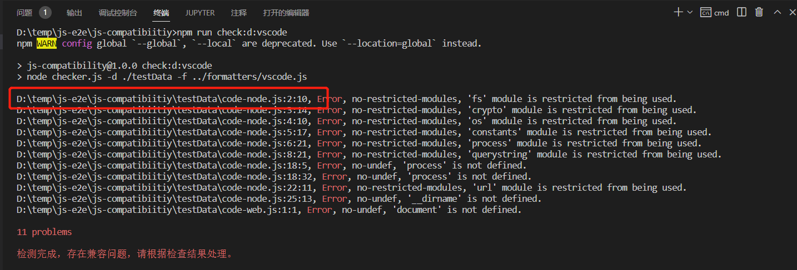

# 简介
基于eslint进行封装、配置规则，分析出JS库代码对NodeJS和Web浏览器的内置模块、对象的依赖及兼容ES标准版本。支持检查指定源码目录和指定三方库的兼容性。

# 环境准备

安装git、nodejs工具，下载本库代码，通过”npm install i“安装依赖即完成程序环境准备，接下来参考下文进行操作。

# 功能说明

## 按目录检查

通过“-d”参数指定要检查的目录，支持相对目录和绝对路径。
```
# 相对路径 ./testData
node checker.js -d ./testData

# 绝对路径
node checker.js -d D:/temp/js-e2e/js-compatibiitiy/testData
```

## 按三方库名称检查

通过“-p”参数指定要检查的三方库名称（完全匹配），工具会自动下载三方库到[./temp]目录下，再执行检查。

```
# 检查jspdf库
node checker.js -p jspdf
```

## 检查规则

基于eslint:recommended扩展一份eslint规则文件[conf/.eslintrc.yml](conf/.eslintrc.yml)，屏蔽所有代码格式相关告警错误，减少干扰。eslint配置、规则（Rule）设置等参考[eslint官方文档](http://eslint.cn/docs/rules/)。

### 指定脚本的运行环境

并在env设置node和browser的值为false，即禁用node.js和浏览器环境，而每种环境都有一组特定的预定义全局变量，如使用这些全局变量则报错no-undef错误。

```yaml
env:
  es6: true
  commonjs: true
  node: false
  browser: false
```

### 指定OH环境不支持的全局变量

在“no-restricted-globals”规则中指定OH环境明确不支持的全局变量，如escape、unescape、eval等，已将目前已知的添加，后续发现新的不支持变量，持续补充。

```yaml
  no-restricted-globals:
    - error
    - escape
    - unescape
    - eval
```

### 禁用通过 `require` 加载的nodejs模块

配置“no-restricted-modules”规则，目前已配置禁止加载nodejs的任意内置模块。

```yaml
  no-restricted-modules:
    - error
    - assert
    - async_hooks
    - buffer
    - child_process
    - cluster
```

## 自定义格式化器

为了更好的查看报告，这里参考的eslint的格式化器（在formatters目录下有源码）定义了几种格式化器，放在[formatters](./formatters)目录下。
- vscode，检查结果输出在标准输出中，方便在VSCode中使用Ctrl+鼠标点击跳转定位到问题所在代码位置。

  

- vscodesimple，输出简化报告，其他同vscode格式化器。简化报告只包含如下几类错误：
  - "no-restricted-global"，禁用特定的全局变量，如escape、unescape、eval会报错，对应eslint配置文件（.eslintrc.yml）中的no-restricted-globals配置。
  - "no-restricted-modules"，禁用通过 `require` 加载的指定模块，对应eslint配置文件中的no-restricted-modules配置。
  - "no-undef"，禁用未声明的变量，如process、document、location等对象，对应eslint配置文件中的env配置中禁用环境中的内置对象。

- csv，将报告输出到csv文件，方便使用Excel查看、分析、统计。

- csvsimple，将简化报告（规则同vscodesimple）输出到csv文件。

### 格式化器使用
如使用的当前项目下的eslint工具，可以建一个链接，将格式化器文件链接到node_modules\eslint\lib\cli-engine\formatters目录（这里就建一个硬链接，因为建软连接报“ 没有足够的权限执行此操作。”，需要管理员权限，而建硬链接不需要管理员权限）。
如使用的是全局eslint，需要将格式化器文件复制到eslint的%node_global%\node_modules\eslint\lib\cli-engine\formatters目录下。如：
```bash
mklink /H .\node_modules\eslint\lib\cli-engine\formatters\csv.js .\csv.js
```

下面就可以使用-f参数指定格式化器。
```bash
node checker.js -d ./testData -f csv
```

也可以不复制格式化器文件文件到node_modules\eslint\lib\cli-engine\formatters目录下，“-f”参数直接接指定的格式化器文件。

```bash
node checker.js -d ./testData -f ../formatters/csv.js
```

# 详细使用说明

可以通过"-h"参数查看使用帮助。

```
D:\temp>node "D:/temp/js-e2e/js-compatibiitiy/checker.js" -h
Usage: checker [options]

Options:
  -d, --dir <dir>              指定要检查的目录
  -p, --package <package>      指定要检查的npm包名
  -o, --output <path>          指定报告的输出路径
  -f, --formatter <formatter>  指定报告格式
  --clean                      清除已下载的包
  -h, --help                   display help for command
```

详细使用示例：

1. 按包名检查，如：检查crypto-js包，要求下载前先清理，并使用csvsimple格式化器输出结果到文件d:/temp/a.txt。

```
node "D:/temp/js-e2e/js-compatibiitiy/checker.js" -p crypto-js -f csvsimple --clean -o "d:/temp/a.txt"
```

2. 检查本地路径源码。

   ```
   node "D:/temp/js-e2e/js-compatibiitiy/checker.js" -d D:\test-code -f csvsimple --clean -o "d:/temp/a.txt"
   ```

另在package.json中已定义了多个测试脚本，可通过"npm run check:d"等执行对应的脚本，可参考使用。

